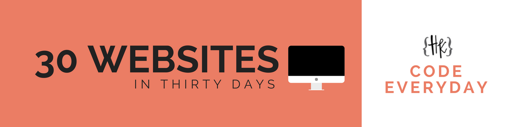

# 30websites-30days

I am challenging myself to build 30 sites in 30 days.

## The Plan

In order to improve my skills, I am committed to building 30 websites in 30 days. The purpose will be to hone my web development skills, explore different CSS frameworks and play with JavaScript and jQuery.

The sites I plan to make will have a theme, and will be the following:

- Podcast
- Event Page
- Real Estate Agent
- Product site
- Restaurant menu
- Book Author
- Trailer movie
- Wedding Website
- Game Store
- Photographer
- Event
- Club
- Landing page
- Printing company
- Motivational speaker
- Charity
- Fashion site
- Accountant
- Candy
- Blog
- Email Newsletter
- Fitness Center
- Gardener
- Online shop
- Recipe site
- Game site
- Hair Salon
- Digital Agency
- Resume
- 404 Page
